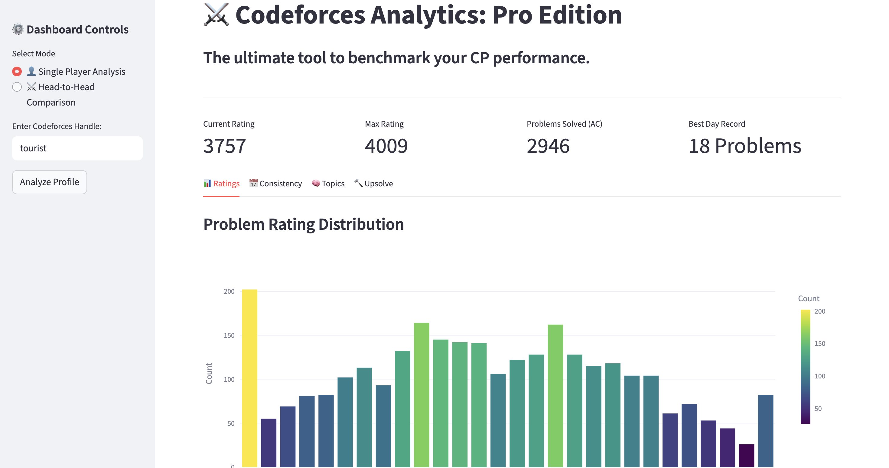
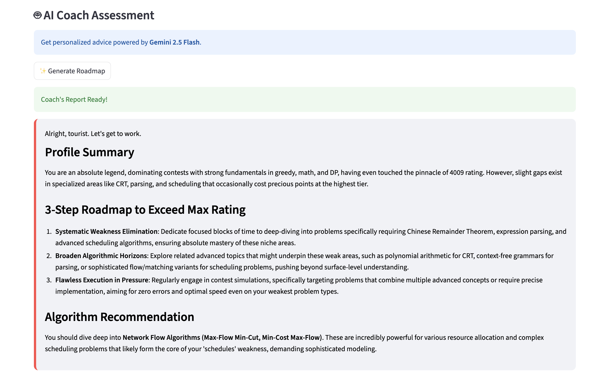

# Codeforces Analytics: Pro Edition


[**Try the Live Dashboard here**](https://cf-analytics-pro-parth-singla-iitp.streamlit.app/)

> **The ultimate benchmarking tool for competitive programmers.** > Visualize your progress, analyze your weak spots, and get AI-powered coaching to reach your next rating tier.

---

## Overview

**CF Analytics Pro** is a data-driven dashboard designed to help competitive programmers improve faster. Unlike standard visualizers, this tool leverages **Google's Gemini 2.5 Flash AI** to act as a virtual coach. It analyzes your submission history, identifies weak topics, and generates a personalized study roadmap.

Whether you are a Pupil aiming for Specialist or a Master aiming for Grandmaster, this tool provides the insights you need.

## Key Features

### Single Player Analysis
* **Performance Metrics:** Real-time tracking of Current Rating, Max Rating, and Problem Counts.
* **AI Coach (Powered by Gemini 2.5):** Generates a 3-step personalized roadmap and specific algorithm suggestions based on your weak tags.
* **Topic Radar:** A radar chart visualizing your strongest and weakest problem tags (DP, Graphs, Greedy, etc.).
* **Consistency Heatmap:** Visualizes your daily submission grind to track consistency.
* **Smart Upsolve Tracker:** Automatically detects problems you attempted but failed, providing direct links to retry them.

### Head-to-Head Mode
* **Rivalry Comparison:** Compare two handles side-by-side.
* **Rating Delta:** See the gap between you and your rival.
* **Similarity Score:** Find out how many common problems you both have solved.
* **Difficulty Battle:** A bar chart comparing who solves harder problems more frequently.

---

## Tech Stack

* **Frontend/UI:** [Streamlit](https://streamlit.io/) (Python-based web framework)
* **Data Processing:** `Pandas` for dataframe manipulation.
* **Visualization:** `Plotly Express` for interactive charts.
* **AI Integration:** `Google Generative AI SDK` (Gemini 2.5 Flash).
* **Data Source:** [Codeforces API](https://codeforces.com/apiHelp).

---

## Installation & Setup

Follow these steps to run the dashboard locally on your machine.

### 1. Clone the Repository
```bash
git clone https://github.com/Parth7234/cf-analytics-pro.git
cd cf-analytics-pro
```

### 2. Install DependenciesMake sure you have Python installed. Then run:

```bash
pip install streamlit pandas plotly google-generativeai requests
```

### 3. Configure API Keys (Crucial Step!)
To use the AI Coach, you need a free Google Gemini API key.
1. Get your key from Google AI Studio.Create a folder named 
2. streamlit in the root directory
3. Inside it, create a file named secrets.toml
4. Paste your key inside:

```bash
# .streamlit/secrets.toml
GEMINI_API_KEY = "AIzaSyYourActualKeyHere..."
```

(Note: The folder must be named exactly .streamlit with the dot). 

4. Run the App
```bash
streamlit run app.py
```
The app will open automatically in your browser at http://localhost:8501.

### Project Structure
```bash
cf-analytics-pro/
├── app.py                 # Main application logic
├── .streamlit/            # Configuration folder
│   └── secrets.toml       # API keys (Not uploaded to GitHub)
├── README.md              # Project documentation
└── requirements.txt       # List of dependencies
```

## **Screenshots**

| Dashboard Overview |
|:---:|
|  |

| AI Coach |
|:---:|
|  |

## **Future Roadmap**
- [ ] **Contest Predictor:** ML model to predict rating changes before a contest ends  
- [ ] **Virtual Contest Mode:** Simulate past contests with a “ghost” opponent  
- [ ] **Group Analytics:** Analyze performance for an entire university batch  

---

## **Contributing**
Contributions are **welcome and encouraged**!  
If you have ideas for new metrics, charts, or features:

1. Fork the repository  
2. Create a feature branch  
```bash
   git checkout -b feature/AmazingFeature
```
3. Commit your changes
4. Open a Pull Request

## **License**
Distributed under the **MIT License**.  

---

## **Author**
**Parth Singla**  
IIT Patna — **B.Tech CSE**

